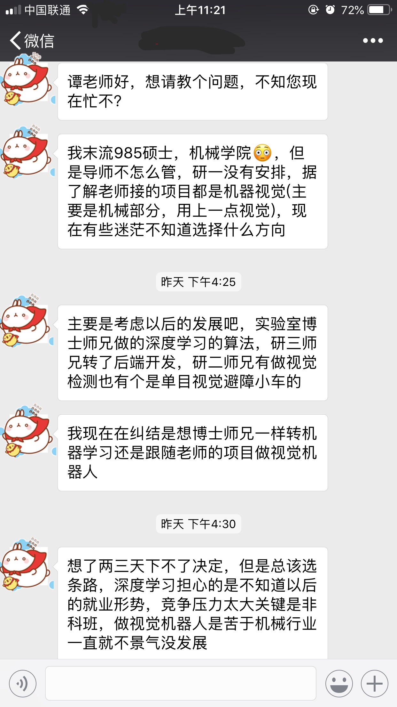
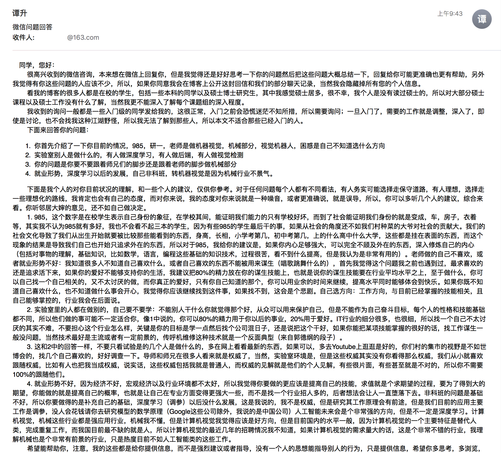
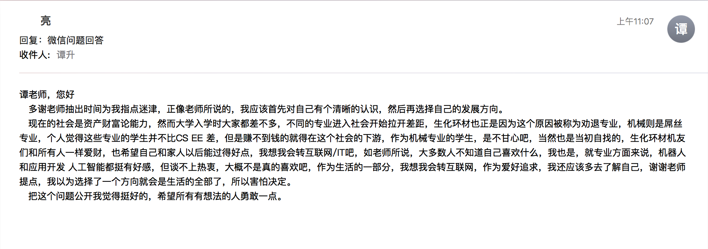

**Abstract:** 一封来自读者的信
**Keywords:** 计算机视觉，就业，人工智能，深度学习
<!--more-->
收到一位读者的来信，字里行间都看到了当年的自己，中间有一些问题觉得很多人可能都有，所以在他同意的情况下，我把邮件部分贴出来，希望能帮助更多的人。

原文：

>同学，您好：
很高兴收到的微信咨询，本来想在微信上回复你，但是我觉得还是好好思考一下你的问题然后把这些问题大概总结一下，回复给你可能更准确也更有帮助，另外我觉得有你这些问题的人应该不少，所以，如果你同意我会在博客上公开这封回信和我们的部分聊天记录，当然我会隐藏掉所有您的个人信息。
看我的博客的很多人都是在校的学生，包括一些本科的同学以及硕士博士研究生，其中我感觉硕士居多，很不幸，我个人是没有读过硕士的，所以对大部分硕士课程以及硕士工作没有什么了解，当然我更不能深入了解每个课题组的深入程度。
我收到的询问一般都是一些入门级的同学发给我的，这很正常，入门之前会恐慌迷茫不知所措，所以需要询问；一旦入门了，需要的工作就是调整，深入了，即使是讨论，也不会找我这种江湖野怪，所以我无法了解到那些人，所以本文不适合那些已经入门的人。
下面来回答你的问题：
1. 你首先介绍了一下你目前的情况，985，研一，老师是做机器视觉，机械部分，视觉机器人，困惑是自己不知道选什么方向
2. 实验室别人是做什么的，有人做深度学习，有人做后端，有人做视觉检测
3. 你的问题是你要不要跟着师兄们的脚步还是跟着老师的脚步做机械部分
4. 就业形势，深度学习以后的发展，自己非科班，转机器视觉是因为机械行业不景气。
下面是我个人的对你目前状况的理解，和一些个人的建议，仅供你参考。对于任何问题每个人都有不同看法，有人务实可能选择走保守道路，有人理想，选择走一些理想化的路线，我肯定也会有自己的态度，而对你来说，我的态度对你来说就是一种噪音，或者更准确说，就是误导，所以，你可以多听几个人的建议，综合来看。你听邻居大婶的意见，还不如自己做决定。
1. 985，这个数字是在校学生表示自己身份的象征，在学校其间，能证明我们能力的只有学校好坏，而到了社会能证明我们身份的就是变成，车，房子，衣着等，其实我不认为985就有多好，我也不会看不起三本的学生，因为有些985的学生最后干的事，如果从社会的角度还不如我们村种菜的大爷对社会的贡献大。我们的社会文化导致了我们从出生开始就要被比较那些能看到的东西，身高，长相，小学考第几，初中考第几，上的什么高中什么大学，这些都是挂在表面的东西，而这个现象的结果是导致我们自己也开始只追求外在的东西，所以对于985，我给你的建议是，如果你内心足够强大，可以完全不顾及外在的东西，深入修炼自己的内心（包括对事物的理解，基础知识，比如数学，语言，编程这些基础的知识技术，过程很苦，看不到什么提高，但是我认为是非常有用的）。老师做的自己不喜欢，或者就业形势不好：我知道很多人不知道自己喜欢什么，或者自己喜欢的东西不能被用来谋生（唱歌跳舞什么的），首先我觉得这个问题我之前也遇到过，最求喜欢的还是追求活下来，如果你的爱好不能够支持你的生活，我建议把80%的精力放在你的谋生技能上，也就是说你的谋生技能要在行业平均水平之上，至于做什么，你可以自己找一个自己相关的，又不太讨厌的做，而你真正的爱好，只有你自己知道的那个，你可以用业余的时间来继续，提高水平同时能够体会到快乐。如果你既不知道自己喜欢什么，也不知道做什么事会开心，我觉得你应该继续找到这件事，如果找不到，这会是个悲剧。自己选方向：工作方向，与目前已经掌握的技能相关，且自己能够掌控的，行业我会在后面说。
2. 实验室里的人都在做别的，自己要不要学：不能别人干什么你就觉得那个好，从众可以用来保护自己，但是不能作为自己奋斗目标，每个人的性格和技能基础都不同，所以他们做的事可能不一定适合你，像1中说的，你可以80%的精力用于你以后的事业，20%用于爱好。IT行业的细分很多，也很细，所以找一个自己不太讨厌的其实不难，不要担心这个行业怎么样，关键是你的目标是学一点然后找个公司混日子，还是说把这个干好，如果你能把某项技能掌握的很好的话，找工作谋生一般没问题，当然技术最好是主流或者有一定前景的，传呼机维修这种技术就是一个反面典型（来自郭德纲的段子）。
3. 这和2中的回答一样，不要只看试验是的几个人是做什么的，多在网上看看最新的东西，如果可以，多去Youtube上逛逛是好的，你们村的集市的视野是不如世博会的，找几个自己喜欢的，好好调查一下。导师和师兄在很多人看来就是权威了，当然，实验室环境是，但是这些权威其实没有你看得那么权威，我们从小就喜欢跟随权威，比如有人也把我当成权威，说实话，这些权威包括我就是普通人，而权威的见解就是他们的个人见解，有些很片面，有些甚至就是不对的，所以你不需要100%的跟随他们。
4. 就业形势不好，因为经济不好，宏观经济以及行业环境都不太好，所以我觉得你要做的更应该是提高自己的技能，求值就是个求期望的过程，要为了得到大的期望，你能做的就是提高自己的概率，也就是让自己在专业方面变得更强大一些，而不是找一个行业招人多的，后者想法会让人一直堕落下去。非科班的问题是基础不好，所以你要做得的是补充自己的基础，深度学习（调参）以后没什么发展，这是我说的，我不是权威，但是研究其工作原理会有前途，但是我们目前的应用主要工作是调参，没人会花钱请你去研究模型的数学原理（Google这些公司除外，我说的是中国公司）人工智能未来会是个非常强的方向，但是不一定是深度学习。计算机视觉，机械这些行业都是强应用行业，机械我不懂，但是计算机视觉我觉得应该是好方向，但是目前国内的水平一般，因为计算机视觉的一个主要特征是替代人类，完成重复工作，而我国目前最不缺的就是人，所以计算机视觉的最近几年的招聘情况我不知道，如果计算机视觉的需求量大的话，这是个非常不错的行业，我理解机械也是个非常有前景的行业，只是热度目前不如人工智能类的这些工作。
希望能帮助你，注意，我的这些都是给你提供信息，而不是强烈建议或者指导，没有一个人的思想能指导别人的行为，只是提供信息，希望你多思考，多浏览，
Tony
Nov,24,2018

收到的回信原文：
>谭老师，您好
 多谢老师抽出时间为我指点迷津，正像老师所说的，我应该首先对自己有个清晰的认识，然后再选择自己的发展方向。
 现在的社会是资产财富论能力，然而大学入学时大家都差不多，不同的专业进入社会开始拉开差距，生化环材也正是因为这个原因被称为劝退专业，机械则是屌丝专业，个人觉得这些专业的学生并不比CS EE 差，但是赚不到钱的就得在这个社会的下游，作为机械专业的学生，是不甘心吧，当然也是当初自找的，生化环材机友们和所有人一样爱财，也希望自己和家人以后能过得好点，我想我会转互联网/IT吧，如老师所说，大多数人不知道自己喜欢什么，我也是，就专业方面来说，机器人和应用开发 人工智能都挺有好感，但谈不上热衷，大概不是真的喜欢吧，作为生活的一部分，我想我会转互联网，作为爱好追求，我还应该多去了解自己，谢谢老师提点，我以为选择了一个方向就会是生活的全部了，所以害怕决定。
 把这个问题公开我觉得挺好的，希望所有有想法的人勇敢一点。

