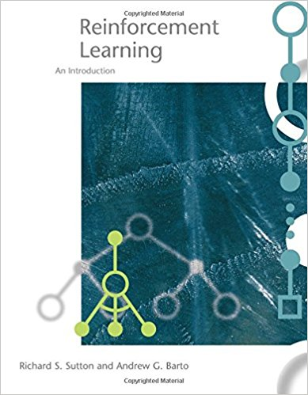

**Abstract:** 本文是 《Reinforcement Learning: An Introduction》 的第一篇，介绍本书以及本系列的主要写作内容
**Keywords:** 学习的本质，诱发与结果(cause and effect)，计算近似，直接建模，强化学习

<!--more-->
## 开篇废话
本系列主要介绍强化学习，使用的教材为：

内容主要来自本教材以及其引用的论文，但是不限于此。
此外，了解我的同学可能知道我喜欢说些没用的废话，本系列该环节省略。本系列部分专业名词保持英文原文，不是为了装x，因为翻译怕不准影响后续学习。
## Nature of Learning(学习的本质)
做人工智能的，或者吹人工智能的所有人应该都曾经尝试思考过，学习的本质是什么，因为我们的“智能”来自学习，可能也有一些遗传因素，我们并不了解学习或者智能的本质是什么，但是我们可以从我们的生活或者其他一些动物的行为和现象中得到一些启示：

- 和环境的Interaction(我想翻译成:“相互影响”，但是觉得不太对）

没错，所有有智能的动物，的所有智能都是来自周围自然环境的，如果把一个人从出生就放在培养基中，完全隔绝所有能和我们行为互动的因素，那么这个人很有可能就是一个有机体，不具备任何智能的器官的组合。
而我们从出生就是开始和自然环境互动，一个婴儿，挥动胳膊，蹬一下腿，或者摇摇头，这些看起来毫无规律和目的的动作就已经跟周围产生了Interaction
## Cause and Effect (诱发与结果)

action的结果是我们从自然环境中获得反馈，所以，我可以负责任的告诉你，BP(反向传导)和现在的依靠BP训练的所有神经网络就是若干年前的SVM没什么可以吹的，所以CNN的开创者们呼吁冷静对待BP是有道理的，而且，可以肯定的是，你的智慧不是BP来的。

我们的智慧的获得的一个主要过程就是，我们能够总结，或者学习到，我们的动作（action）能够产生什么结果，然后，为了获得某个结果，我们需要做什么。这也是我们获得智慧的主要来源就是这一些列的过程。

目前近乎所有关于学习和智能的基础思想都是 —— 从interaction中学习。
## Computational Approach or Directly Theorizing (计算近似 vs 直接建模)
人工智能的最终目的就是让机器有动物或者人一样的智慧，而达到这个目的目前有两种主流方案
- 直接建模
- 近似计算

直接建模的思想比较简单，就是用复杂的算法或者机制，直接产生智慧，目前来看有难度，毕竟智慧不是“鸡兔同笼”或者 “疯狂的泳池管理员”这种数学模型。
另一种做法是通过用算法迭代，近似，自动的生成一个模型，来模拟一种行为（智慧的一部分），而这个过程主要有两步：
1. explore 抽象的情况
2. evaluate 多种学习结果的 Effectiveness

这两步就是AI研究人员和工程人员的主要研发对象了。他们的主要工作就是制造一部机器（算法），解决类似的问题，这个机器(算法)必须有以下特征：
1. Evaluating -- 评估设计(通过数学分析)
2. Computational -- 计算近似结果

设计这个机器的过程，就是 “**强化学习**”

强化学习只研究 goal-directed 学习过程，主要研究对象是Interaction。而不是其他例如残差，或者其他损失函数，这些机器学习关注的目标。

## 总结

深度学习关注interaction，是一种goal-directed的过程，和其他机器学习算法有本质的不同，更接近人或者智慧生物的学习过程。

原文地址：[https://www.face2ai.com/RL-RSAB-1-0-Introduction](https://www.face2ai.com/RL-RSAB-1-0-Introduction)转载请标明出处
