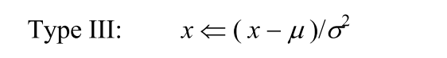

**Abstract:** 不同的输入对CNN的影响
**Keywords:** CNN，输入数据

# CNN训练数据讨论
## 问题回顾
对于神经网络，同一样本不同的表现形式，不同的Normalization的方式，作为输入会带来不同的结果。
## 具体数据
### 分析
所谓同一样本的不同形式，比如彩色图片的不同色彩空间描述，RGB，YUV(YCbCr)，LIS等色彩空间有着不同的表现方式，其本质（数学模式）虽然不同，但视觉效果都表征同一样本，或者将样本变形成灰度图像，样本类别没有发生变化，只是描述发生了转换，更深层的说法就是变量的域发生了改变。
以上描述了同一样本不同域的变化，相反，在同一域下，数值的scale也会引起训练结果的变化，原因笔者目前还不清楚，期待研究明白后能给出通俗，简单的解释。

### 实验[^1]
文章对行人进行性别分类，网络结构采用最古老的LeNet作为模板，对训练样本进行不同的处理产生了不同的结果，比较如下：

色彩空间变换，RGB，GRAY，YCbCr
YCbCr转换公式：

Normalization方式：

实验结果：

### 总结
不同变量域最后的结果差别较大
不同的Normalization的结果也不相同，Normalization的结果优于不normalization的结果。
另外，Normalization也会影响收敛速度

[^1]: Ng, Choon-Boon, Yong-Haur Tay, and Bok-Min Goi. "Comparing image representations for training a convolutional neural network to classify gender." In *2013 1st International Conference on Artificial Intelligence, Modelling and Simulation*, pp. 29-33. IEEE, 2013.

