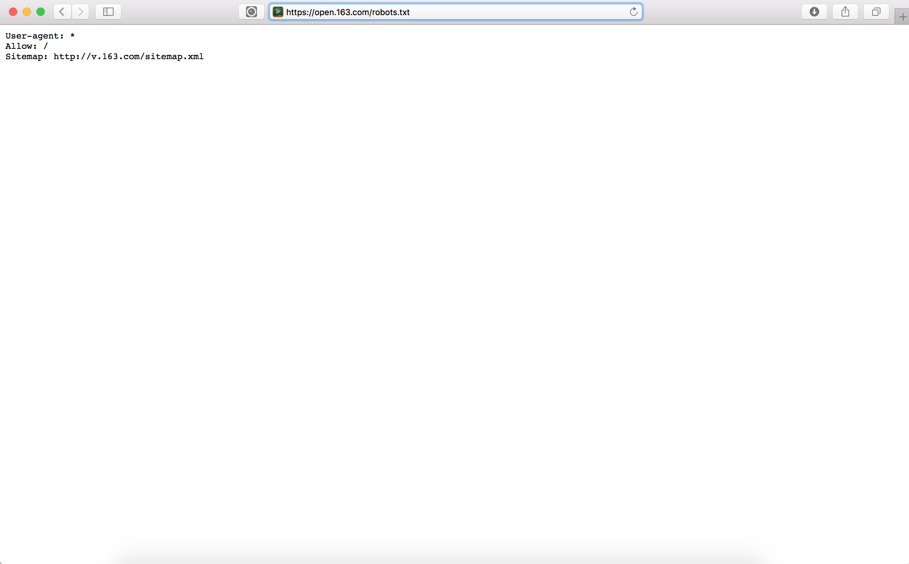
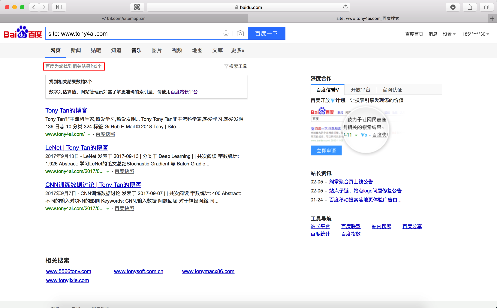
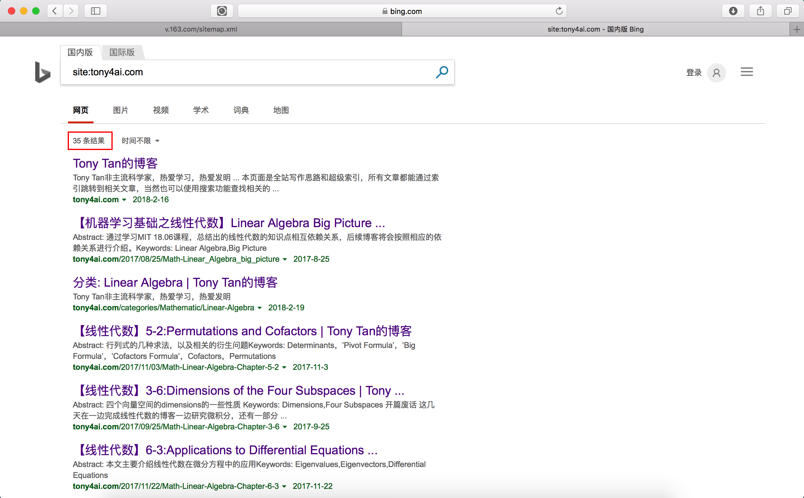
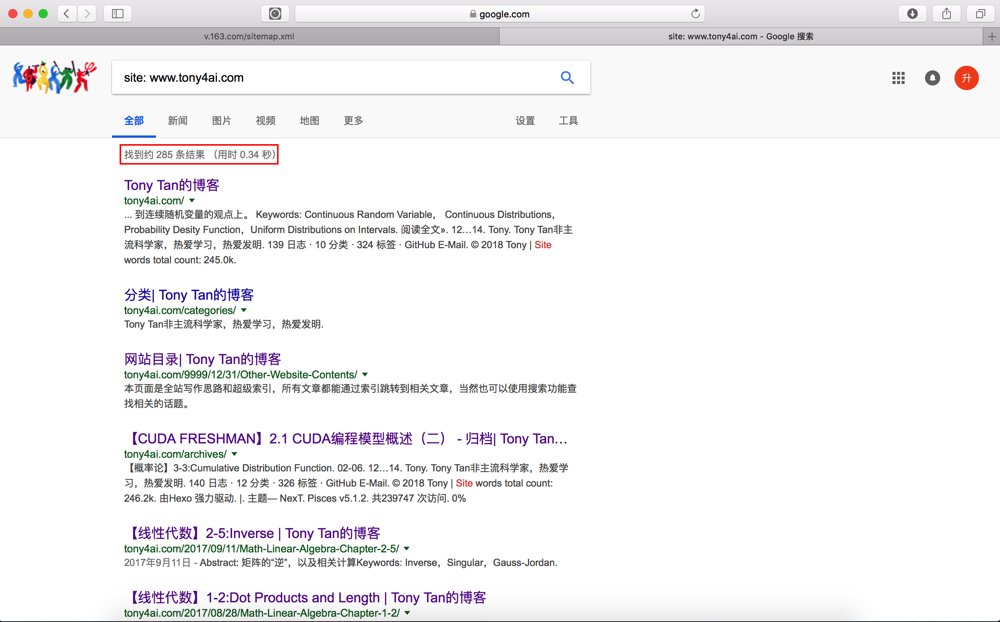
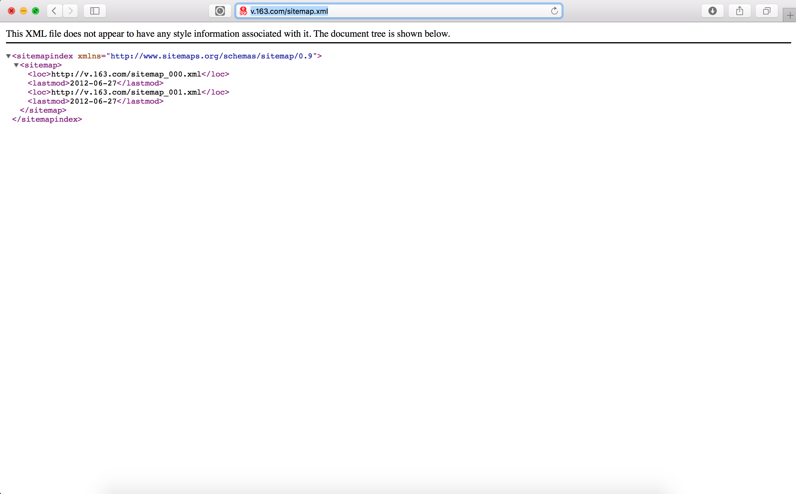
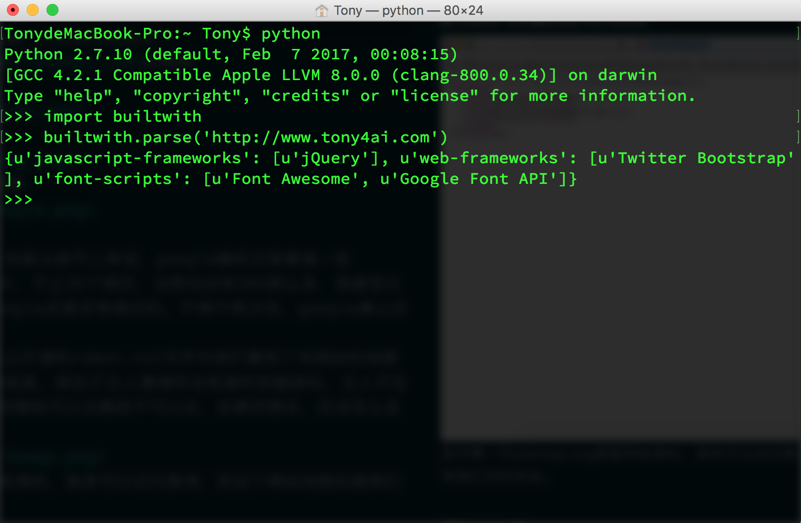
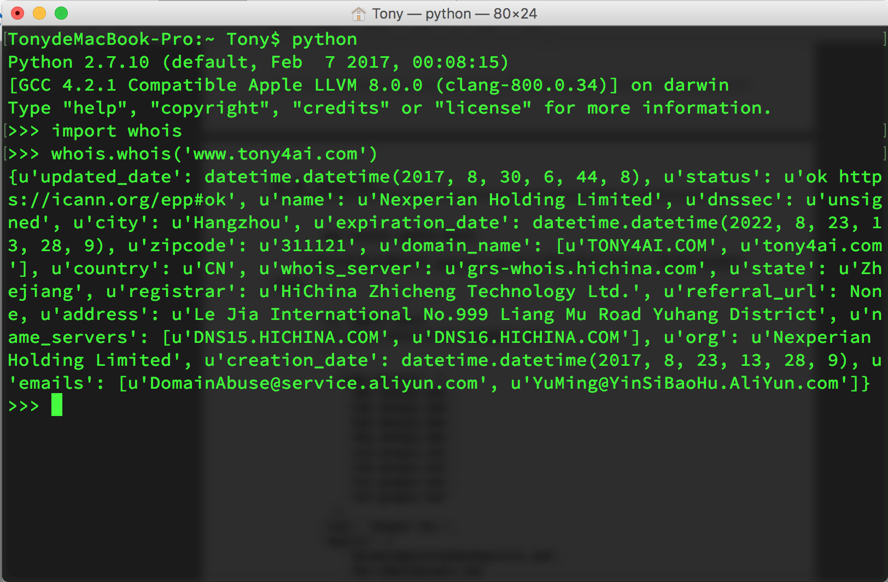

**Abstract:** 分析网站，进行数据收集
**Keywords:** builtwith，网站规模

<!--more-->
# 分析目标网站
还是前一篇那个主旨，我的个人目标不是前端或者爬虫专家，我的主要目标是机器学习算法，所以爬虫系列爬虫显得浅显和幼稚，只给大家一个入门的建议，没有进阶或者深入部分。
## 爬虫何时使用
爬虫使用还是收集数据或者分析网站数据时，关于爬虫合法性，这个各个国家都不一样，涉及法律问题请大家查询当地法律条文。
## 网站分析
分析网站的前提是你知道要爬谁，而要爬谁这个要手工确定，这样我们可以精确打击了，如果不能精确打击，恭喜你，你做的爬虫可以改名叫搜索引擎了。
### Robots.txt
对目标网站的robots.txt进行访问，robots中包含了这个网站对于哪些内容是允许爬取的，哪些是不能的，相当于网站所有者或者管理者对于爬虫的行为约束，当然这个不是强制性的，数据收集者也就是我们，我们可以完全不在意他说什么，而尽情的收集我们所需要的，但是，***这是不道德的***

上图就是网易公开课的robots.txt文件的内容，其中允许我们爬取'/'下的内容，而且给我了我们一个地图，没错，这个就是下面我们要说的地图。
### 网站大小与地图
在说地图前，我们先研究一下网站大小，我们可以利用搜索引擎来确定下网站的大致规模，用到的搜索引擎技术是在搜索框里使用'site:example.com'，就会得到大致的网页数量，从而可以大致的估算网站规模，比如我们来测试一下[face2ai.com](http://www.face2ai.com)的规模：
1. 先看我们的baidu，3个结果

2. 看一下bing，35个结果

3. 最后看一下google，285个结果


这个没办法说谁搜的好谁搜的快，但是从细节上来说，google确实还是要强一些
规模上来说face2ai.com确实不大，不止35个网页，当然也没有285那么多，我感觉大概也就是200个网页左右，所以google还是非常接近的。不得不再次说，google真心厉害。
接着就是地图啦，我们在观察网易公开课的robot.txt文件中我们看到了本网站的地图，这个地图会给我们提供非常多的信息，类似于主人邀请你去他家的宫殿游玩，主人不在，又怕你迷路，所以robots告诉你哪些可以去哪些不可以去，如果你想去，应该怎么走，这个应该怎么走就是地图啦。

其中第一行sitemap.org是提供标准的，具体可以访问查询，而这个网站地图后面我们将会使用它来引导我们访问全站。
### 网站技术
接下来就是研究一下网站使用啥写的，我虽然不做网站，但是也知道构建网站的方式不止一种，于是针对不同技术，我们理论上是有不同的爬虫技术与其对应，当然这是高级的做法了，我们这种入门选手不需要这么专业，但是基础就是为了专业而大的，了解下网站技术，对我们精确打击是有很大帮助的，而获得信息的方式是使用python的一个叫做builtwith的工具包：


用到的代码：
```python
import builtwith
print builtwith.parse('http://www.face2ai.com')
```
就能得到这个网址对应的网站是使用什么技术搭建的。
### 网站所有者
接着上面那个工具包，又一个工具包叫做whois，用来检测我们的目标网站属于谁，不能打了半连对方是谁都不清楚，那不就白打了么。
```python
import whois
print whois.whois('http://www.face2ai.com')
```


千万要注意，whois和python-whois是两个不同的工具包，我们要用的是python-whois，上面的信息是阿里云，但是所有者里好像没有我的名字啊。。老子可是花了钱的好不好，虽然是租的。。。
## 爬取方案设计
爬虫设计方案主要看我们的目的。
有些网站我们需要根据主目录一页一页的爬取每个目录中对应连接中的内容，这是一个典型的广度优先，根据网站目录，每页搜索。
第二是漫无目的的搜索，就是当我们进入一个网页先按照深度优先的方式逐级推进至最深层次，然后返回以此迭代。
归根到底还是看我们的需求，所以深度优先搜索还是广度优先搜索，都有用处，但是场合不同。
## 总结
这一集干货不多，也有一点，下面我们就要开始研究怎么欺骗或者访问服务器，让他们给我们发送回响应了，这才是难点！待续。。。


