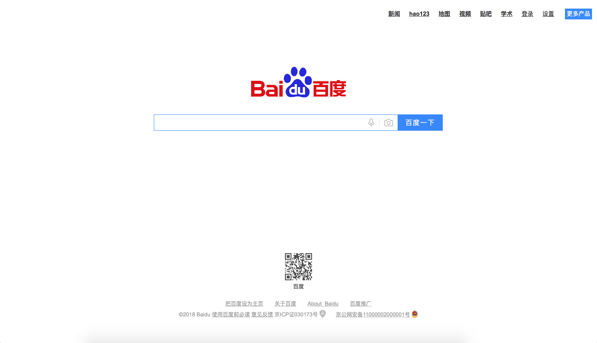
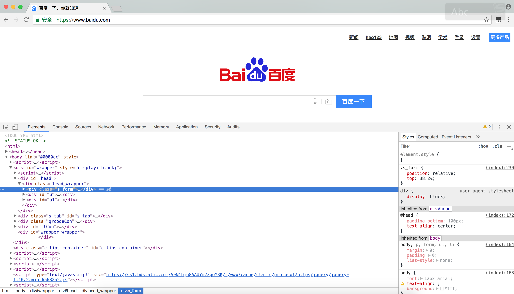
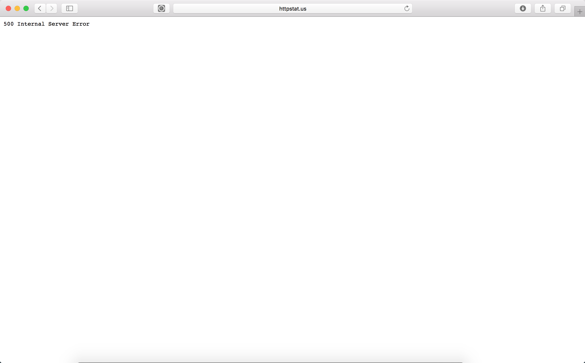
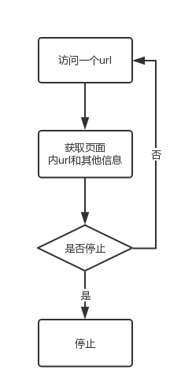
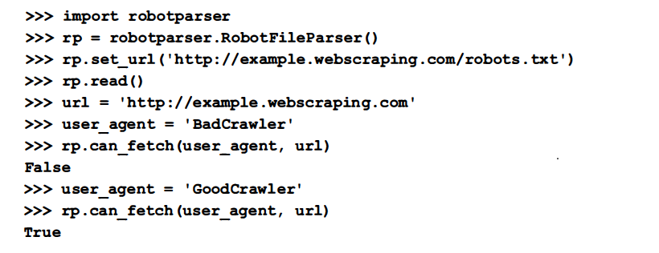

**Abstract:** 本文介绍第一个naive爬虫，同时也给出三种不同方式的
**Keywords:** 网站地图爬虫，ID遍历爬虫，链接爬虫

<!--more-->
# 三只爬虫
今天废话不多说，争取多写点爬虫的内容，后面回去了主要还是要进攻基础理论知识，心怀希望则不会迷茫！
再次说明，爬虫对于我是非常有用的一个工具，但是我并不是也不想深入成为爬虫专家，所以这一系列的博客，都相对浅显入门，只给大家提供一个没有肉的骨架，具体应用请咨询更专业的书籍。
## 下载网页
我们上网查资料一般都是通过网页上的文字获得的了，信息蕴藏在文字中，我们的爬虫为了获得信息，第一步就是获得文字。
我们要用浏览器访问地址才能得到服务器的响应，浏览器把服务器响应可视化，我们就能看到文字图片听到声音等，所以我们最关键，最重要的技术就是，使用python向服务器发送请求，然后把响应翻译筛选出有效信息，而且有些时候不能让服务器发现是python在访问而是让他错以为是人在操作。
### urllib2
python的urllib2是一种常用的下载工具，当然不是唯一的工具，对于工具的学习，我们分成两种，一种是自己本专业的工具，我们要非常熟悉，而且知道其原理和理论，比如我们研究图像处理，opencv的这个工具不但会用还要研究其算法和实现，而其他工具就不需要花费太多的精力在其原理上，而是更多关注其操作流程，及时查询文档，就能完成任务。
我们可以定义一个简单的下载函数：
```python
## -*- coding:utf-8 -*-
import urllib2
def download(url):
    print 'Downloading: ',url
    try:
        html=urllib2.urlopen(url).read()
    except urllib2.URLError as e:
        print 'Downloading error:',e.reason
        html=None
    return html

if __name__=='__main__':
    url='https://www.baidu.com'
    html=download(url)
    print html
```
输出：
```html
<html>
<head>
	<script>
		location.replace(location.href.replace("https://","http://"));
	</script>
</head>
<body>
	<noscript><meta http-equiv="refresh" content="0;url=http://www.baidu.com/"></noscript>
</body>
</html>
```

上面的这段代码作用是向url：'https://www.baidu.com' 所在的服务器发送请求，显示的html显示这是一个跳转，转到'http://www.baidu.com'， 服务器返回的就是上面的html代码，我们看到的就是：

而我们通过浏览器查看其源代码：


### 重试下载
上面的代码有个try的代码块，Python知识，try后的语句可能出现错误，如果出现错误，except语句开始执行，返回错误信息，有些时候下载网页有可能是网络暂时性问题，也就是说返回错误了虽然，但是再来一次很有可能成功，这类错误的代号是从500到600之间的，如果发生看404这类错误，很遗憾没有重试的必要了，不是撞墙了，就是人家没有这一页。
代码中加入重试：
```python
def download(url,num_retries=2):
    print 'Downloading:', url
    try:
        response = urllib2.urlopen(url).read()
    except  urllib2.URLError as e:
        print 'download error:', e.reason
        response = None
        if num_retries > 0:
            if hasattr(e, 'code') and 500 <= e.code < 600:
                print 'download retry'
                return download(url, num_retries - 1)
    return response
```
当发现错误是500到600之间时重试，递归调用本函数，重试次数就是递归深度。
```python
hasattr(obj,name)
```
函数说明：判断obj对象中是否有name属性或方法。
我们可以测试一个我们预先设定好的网页，他作用就是返回错误500

输出结果：
```bash
Downloading: http://httpstat.us/500
download error: Internal Server Error
download retry
Downloading: http://httpstat.us/500
download error: Internal Server Error
download retry
Downloading: http://httpstat.us/500
download error: Internal Server Error
None
```
### 用户代理
像我们这种小菜如果控制了特别大的带宽的时候而又没控制好虫子，虫子很有可能把别人的网站爬崩溃，而我们通过上述简单的方式访问服务器时，服务器会识别出我们的用户是：python-urllib/2.7后面是版本号，前面是python-urllib。于是一些网站禁止这个用户访问自己的网站，所以我们要给自己改革名字，这个就是用户代理。
```python
def download(url,user_agent='tony',num_retries=2):
    print 'Downloading:', url
    headers = {'User-agent': user_agent}
    request = urllib2.Request(url,None,headers)
    try:
        response = urllib2.urlopen(request).read()
    except  urllib2.URLError as e:
        print 'download error:', e.reason
        response = None
        if num_retries > 0:
            if hasattr(e, 'code') and 500 <= e.code < 600:
                print 'download retry'
                return download(url, num_retries - 1)
    return response
```
这个用户名就变成了tony.
接下来就要写三种不同套路的小虫子了，茴香豆的茴字有四种写法，你知道么？
## 网站地图
上文我们提到过网站地图，这一小结，我们就将利用这个地图爬取网站数据。
有些网站的sitemap中会给你所有的本站的地址例如：
[http://example.webscraping.com/places/default/sitemap.xml](http://example.webscraping.com/places/default/sitemap.xml)
我们使用下面代码，配合download能够得出结果：
```python
def crawl_sitemap(url):
    sitemap=download(url)
    links=re.findall(r'<loc>(.*?)</loc>',sitemap)
    for link in links:
        html = download(link)
        ## do something
        print 'crawl site:',link
```
这是一个非常简单的方式，xml中<loc>、</loc>之间是一个连接，用正则表达式找出所有的连接，那么就获得了全部的访问地址，然后每一个都访问一下就可以了
正则表达式我们后面会有专题。
## ID遍历爬虫
观察我们上面爬到的那个网站:
[http://example.webscraping.com/places/default/view/1](http://example.webscraping.com/places/default/view/1)

[http://example.webscraping.com/places/default/view/Afghanistan-1](http://example.webscraping.com/places/default/view/Afghanistan-1)

他们两个指向同一个页面，数据库端一般只用id来匹配数据，而这些别名Afghanistan-1，是用来方便搜索引擎工作的，那么按照这个例子，就可以不断修改第一个链接中的1，从而获得所有的网页了。
当然问题来了，如果1，2，3，4，5中我们删掉了一页，那么循环没办法继续下去了，我们就要设置另一种策略来避免这种尴尬，就是如果只有1，4，5，6等，我们可以当遇到2，3，时发生错误不退出，而是继续循环，那么就可以爬到后面的了，只要设置一个断开的距离不超过多少，如果超过了则跳出循环即可解决问题。
## 链接爬虫
这种爬虫才是最正规的爬虫，前面两种虫子都是比较特例的，当我们分析完目标站时，发现其具有上述两种性质时，这两种虫子才有作用，当时对于一般网站，我们只能用一般的办法，链接虫子，一种通用的高端虫。其一般过程如下：



把上面的过程代码化前，必须明确几个问题
1. 就是网站内死循环的问题，网页A包含B的链接，B包含C的链接，C包含A的链接，这样下去循环往复，无休无止。解决办法就是用一个list或者其他数据结构保存已访问的网页，每次访问前判断是否重复访问，不重复，则访问。
2. 网站内链接有些是以相对路径，也就是和只写了一半的路径，我们需要补全
3. robots文件的加入使爬虫正规化

### 简单的框架
```python
import urllib2
import re
def get_links(html):
    webpage_regex =re.compile('<a[^>]+href=["\'](.*?)["\']',re.IGNORECASE)
    return webpage_regex.findall(html)

def link_crawler(seed_url,link_regex):
    crawl_queue=[seed_url]
    while crawl_queue:
        url=crawl_queue.pop()
        html=download(url)
        for link in get_links(html):
            if re.search(link_regex,link):
                crawl_queue.append(link)

def download(url,num_retries=2):
    print 'Downloading:', url
    try:
        response = urllib2.urlopen(url).read()
    except  urllib2.URLError as e:
        print 'download error:', e.reason
        response = None
        if num_retries > 0:
            if hasattr(e, 'code') and 500 <= e.code < 600:
                print 'download retry'
                return download(url, num_retries - 1)
    return response

if __name__=='__main__':
    url='http://example.webscraping.com'
    link_crawler(url,'/(index|view)')
```

这段代码看上去没啥问题，但是运行时会出现错误，就是我们上面问题2的问题，有些地址是相对地址：
```bash
Downloading: http://example.webscraping.com
Downloading: /places/default/index/1
Error
......
```
### 支持相对地址
错误信息省略，那么我们怎么改进呢，当然是加上前半段的地址啦：
```python
import urlparse
def link_crawler(seed_url,link_regex):
    crawl_queue=[seed_url]
    while crawl_queue:
        url=crawl_queue.pop()
        html=download(url)
        for link in get_links(html):
            if re.search(link_regex,link):
                link=urlparse.urljoin(seed_url,link)
                crawl_queue.append(link)
```
就可以正确的下载了，当然，问题1还没有解决，就是循环访问的问题，我们的解决办法
### 避免循环访问
我们添加一个集合的结构体来保存访问过（或者将要访问）的地址，需要访问时查询是否访问过，如果没有则加入将要访问的列表中：
```python
def link_crawler(seed_url,link_regex):
    crawl_queue=[seed_url]
    seen=set(crawl_queue)
    while crawl_queue:
        url=crawl_queue.pop()
        html=download(url)
        for link in get_links(html):
            if re.search(link_regex,link):
                link=urlparse.urljoin(seed_url,link)
                if link not in seen:
                    seen.add(link)
                    crawl_queue.append(link)
```
上面这个版本如果没有问题就能访问网站中所有的网页了，这个爬虫是可用的。
### robots
我们上一篇提到过robots.txt，里面有一些可以访问以及不可以访问的路径，我们可以通过python工具包robotparser来自动解析使用(贴一段书上的截图吧)：


### 支持代理
有些网站对地区等访问有限制，当然万里长城那个不是这类的，有些网站站长就不希望别的国家人访问，但是我们还想访问，怎么办，vpn或者通过代理，python有个requests模块可以实现这部分功能，这个部分应该在download中完成，那么新版本的download函数如下：
```python
def download(url,user_agent='tony',proxy=None,num_retries=2):
    print 'Downloading:', url
    headers = {'User-agent': user_agent}
    request=urllib2.Request(url,headers=headers)

    opener=urllib2.build_opener()
    if proxy:
        proxy_params={urlparse.urlparse(url).scheme:proxy}
        opener.add_handler(urllib2.ProxyHandler(proxy_params))
    try:
        response = opener.open(request).read()
    except  urllib2.URLError as e:
        print 'download error:', e.reason

        response = None
        if num_retries > 0:
            if hasattr(e, 'code') and 500 <= e.code < 600:
                print 'download retry'
                return download(url, num_retries - 1)
    return response
```
上面的代码设置了代理服务器，urllib2的功能很强大，但是
用起来稍微可能麻烦点，我们下一篇介绍下代理服务器和整个响应过程的主要知识，所以这部分不明白流程的可以不用着急，结合下一篇看更明了！
### 下载限速
如果我们为了自己爬数据把人家服务器搞崩了，其实不道德也耽误我们自己的进度，所以设置下载限速或者加入休眠，可以很好的解决这个问题。
```python
import datetime
import time
class Throttle:
    """
    限速
    """
    def __init__(self,delay):
        self.delay=delay
        self.domains={}

    def wait(self,url):
        domain=urlparse.urlparse(url).netloc
        last_accessed=self.domains.get(domain)

        if self.delay>0 and last_accessed is not None:
            sleep_secs=self.delay-(datetime.datetime.now()-
                                   last_accessed).seconds
            if sleep_secs>0:
                time.sleep(sleep_secs)
                print 'sleep %d sec'%sleep_secs
        self.domains[domain]=datetime.datetime.now()
```
同时在下载前一步加入如下语句：
```python
def link_crawler(seed_url,link_regex,delay=1):
    throttle=Throttle(delay)
    crawl_queue=[seed_url]
    seen=set(crawl_queue)
    while crawl_queue:
        url=crawl_queue.pop()
        throttle.wait(url)
        html=download(url)
        for link in get_links(html):
            if re.search(link_regex,link):
                link=urlparse.urljoin(seed_url,link)
                if link not in seen:
                    seen.add(link)
                    crawl_queue.append(link)
```
这样就完成了一个两个链接之间的访问间隔设定。
### 避免陷阱
设定访问深度，当达到深度后不再继续下去，因为有些链接可以无限向后链接的，比如有些日历，爬虫要避免落入深渊中，所以设定最大深度好处多多

## 总结
两个小虫子，一个大虫子，大虫子比较通用，小虫子适合特定场景，明天继续。。。


