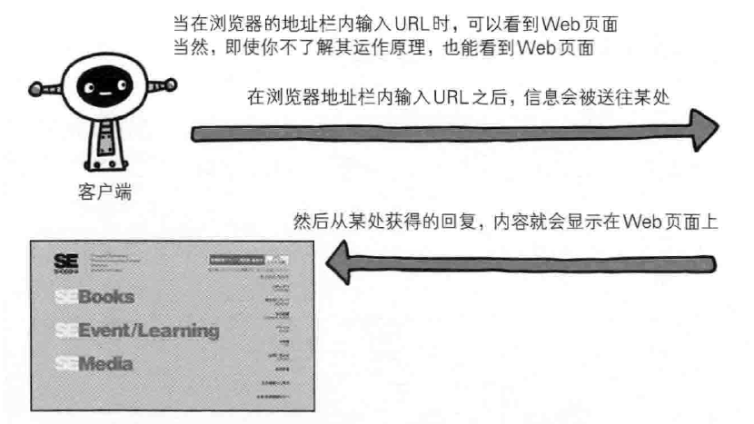
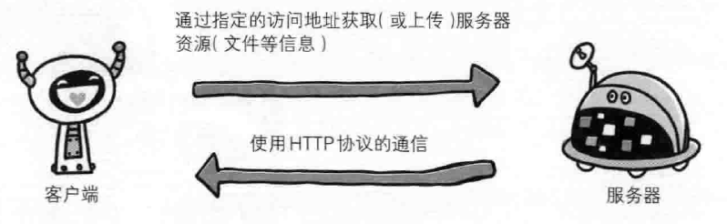
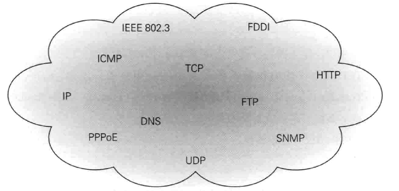
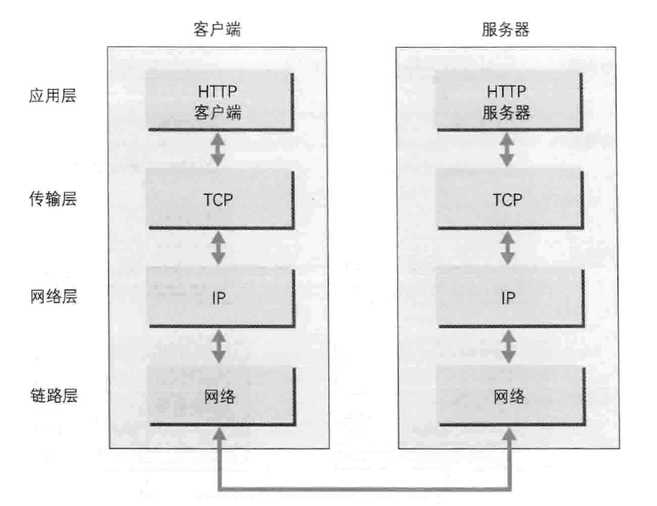
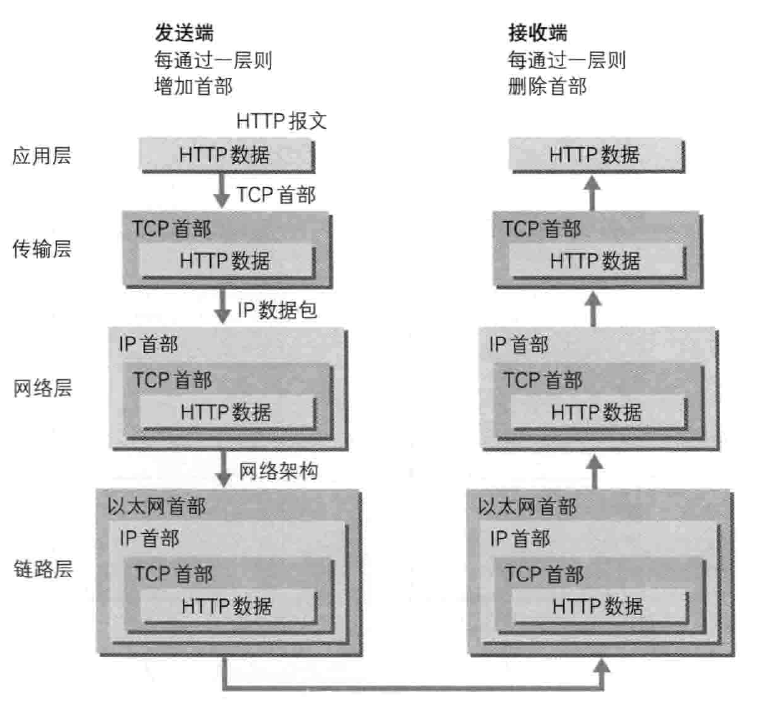
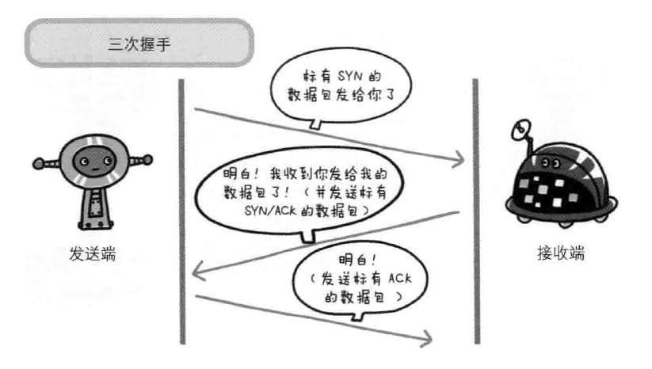
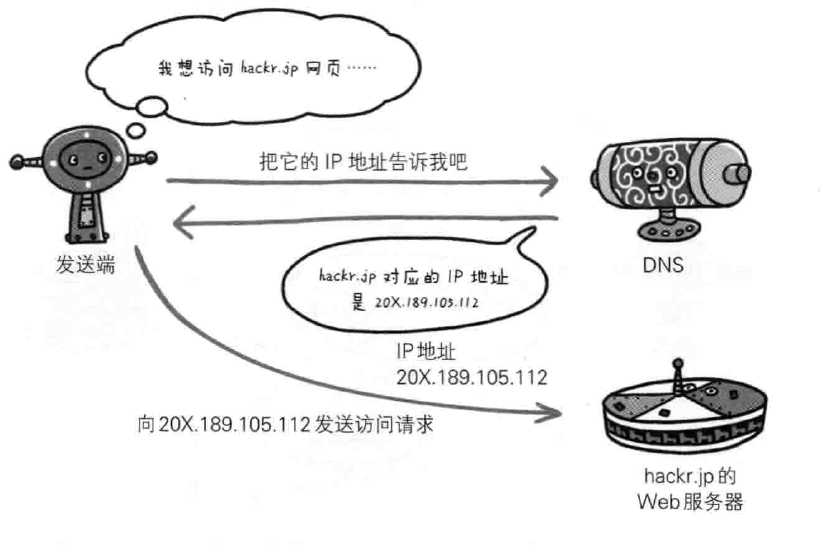
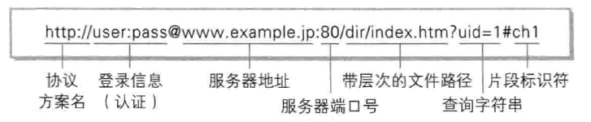

**Abstract:** 本文介绍HTTP基础知识的入门讲解，没有深入，主要是为了让我们知道爬虫请求服务器响应的大致过程
**Keywords:** http,web,tcp/ip,uri/url

<!--more-->

# 爬虫HTTP协议(一)
还是昨天那套，我不是爬虫专家或者前端后台专家，我的努力方向也不是这个方向，我只是想要运用这套技术，但是我又希望对整个过程有一个比较详细的了解，所以我在本系列只是简单介绍，有些东西可能含糊不清，需要详细学习的同学可以去查询相关资料
## HTTP简史
我们访问网站，在地址栏中输入一个网址就能访问网址对应的网站内容，看起来很常用的一套操作，背后隐藏了什么样的技术，我们并不很清楚的知道，我们今天这篇和下一篇就是大概的介绍这个过程。

如果我们进一步抽象，我们可以把我们的浏览器或者其他工具称之为客户端，而响应我们请求或者存储我们想要的信息的成为服务器。
他们之间的一系列的运作流程使用http（超文本传输协议）

### 提出
而http的最初提出为了是科研机构之间的知识共享，最初的设计理念是：借助多文档之间的相互关联形成的超文本，连成可相互参阅的www万维网。
WWW的构建技术分别是：
1. SGML（Standard Generalized Markup Language）作为页面的文本标记语言的HTML（HyperText Markup Language）
2. 作为文档传递协议的HTTP
3. 指定文档所在地址的URL（Uniform Resource Locator）
### 成长
Web的成长
日本第一个主页 -> HTML1.0 -> NCSA Mosaic bounce page -> The NCSA HTTPd Home Page

## 网络基础TCP/IP
TCP/IP协议族，这个学过计算机的都知道，完整学习，估计要很长很长很长一段时间，做通讯的可能要深入研究，我们这里还是学习其中浅显易懂的入门知识。
### TCP/IP协议族
计算机与网络设备通讯肯定是相互的，不能像我们寻找外星人一样，发出讯息几千年没有回应，我们访问网络需要的是立刻马上得到信息，而相互通讯的基础就是使用相同的方法一个说中文一个说英语，这样的沟通是低效的，高效的方法就是都说中文，或者都说英文。
访问网络设备，如何探测到通讯目标，由谁先发起通讯，使用什么语言，怎样结束都需要规定清楚，而且如果各个网站都不同，浏览器也没办法通用，所以大家最好都是按照一个规则，这样浏览器就会更容易设计。
这种规则称之为协议：

协议管的非常宽，包括电线规格到ip地址选定方法，寻找异地用户方法，建立通讯顺序都需要协议来规范，可想而知，这个协议的体量应该是超级大的。
### TCP/IP的分层结构
TCP/IP协议是分层的，这个是TCP/IP最重要的一个结构
1. 应用层：向用户提供应用服务时通信的活动
2. 传输层：对上层应用层，提供处于网络连接中的两台计算机间的数据传输
3. 网络层（网络互连层）：处理网上流动的数据包，数据包是网络传输的最小单位，该层规定了通过怎样的路径所谓的传输路线到达对方计算机，并把数据包传送给对方
4. 链路层（链路层，网络接口层）：硬件部分，操作系统，驱动，网卡，光纤

### 传输流

上图就是最典型的传输流，我们就考虑我们访问网站的过程，也就是HTTP说明：
首先客户端在应用层发出一个想看某个web网页的HTTP请求。
接着，为了传输方便，传输层（TCP协议）把从应用层收到的数据（HTTP请求报文）进行分割，并在各个报文上打上标记序号及端口号，转发给网络层。
在网络层（IP协议），增加作为通信目的地的MAC地址后转发给链路层，这样一来，发往网络的通信请求就准备齐全了。
到了服务器端，操作与上述基本相反，从链路层收到的数据按书序往上发送一直到应用程序：

每一层都要加包装，把数据信息包装起来的做法叫做封装
## IP/TCP/DNS与HTTP
### 负责传输的IP协议
几乎所有的网络系统都要使用IP协议，与IP地址不同，IP协议是一个很大的集合。
在发快递的时候，为了确保对方是真正的接收方，我们一般会写地址，和手机号，类似的IP协议中的做法是ip地址和mac地址。
一般情况下，我们不但要和内网的计算机通讯，更多的是和外网的计算机通讯，外网通讯一般要听过很多网络中转设备才能到目标服务器，这个过程和发快递也很相似，快递逐步转运；搜寻下一站去哪，就要使用MAC地址，采用ARP协议解析地址，根据通信方的IP就可以反查出对应的MAC地址（有点混乱，具体可查询相关资料）
网络上的情况是复杂的，没有人能确定当前网络中的传输状况，在到达目的地服务器之前，我们不确定数据包都经过了哪些设备，我们只能大致估算。无论哪台计算机，网络设备都无法掌握全部的互联网细节。

### 可靠的TCP协议
为了确保到达目标TCP进行三次握手，确认无误：

当然TCP还有别的策略保证通讯准确无误
## DNS域名解析
DNS和HTTP一样，也是应用层的一个协议，主机除了Ip地址也可以被赋予主机名和域名，比如[www.face2ai.com](https://www.face2ai.com)这种字符串比IP地址和主机名好记多了，而域名对应的IP地址需要用dns服务器来解析：

## HTTP与各个协议
HTTP使用时，下面的简图可以大致反应各个协议发挥的作用：

## uri和url
URI统一资源标识符，我们更熟悉URL，在web浏览器中输入[www.face2ai.com](https://www.face2ai.com)就能访问相关地址

Uniform Resource Identifier的缩写，定义如下：
- Uniform
规定统一的格式可以方便处理不同类型的资源，而不需要根据上下文环境来识别资源指定的访问方式，另外加入新增的协议方案（比如http: 或https:）也很容易
- Resource
资源的定义是可标识的任何东西，除了文档图片或者服务，都是资源
- Identifier
可标识的对象，也称为标识符
举几个例子：

URI表示的互联网的某一个资源
比如：***http://www.iana.org/assignments/uri-schemes***
URL表示一个地址，可见，URL是URI的一个子集。
URI的格式分为绝对URI和相对URI，同样下面的URL也是分为绝对URL和相对URL，URI的格式如下：

- http:
是访问资源用到的协议类型，也可以是data: javascript:
- 登录信息
用户名和密码是登录服务器必要信息
- 服务器地址
绝对uri必须制定访问服务器地址
- 服务器端口号
可选，如果省略就是默认端口号
- 带层次的文件路径
指定服务器文件路径来定位指定资源
- 查询字符串
对于指定的资源可以传入参数，此项也是可选的
- 片段标识符
使用片段标识符通常可标记处以获取资源中的子资源，文档的某个位置

## 总结
本文简单的介绍了HTTP相关的一些简单知识，下一文我们介绍更多详细内容。

