**Abstract:** 本文介绍HTTP基础知识的入门讲解，没有深入，主要是为了让我们知道爬虫请求服务器响应的大致过程
**Keywords:** http,uri/url

<!--more-->
# 爬虫HTTP协议(二)
回家的假期马上就要句号了，返程图中写于哈尔滨友谊路392号全集酒店

> I had been rejected,but I was still in love. --Steven Jobs

还是需要强调的一点：**我不是爬虫专家或者前端后台专家，我的努力方向也不是这个方向，我只是想要运用这套技术，但是我又希望对整个过程有一个比较详细的了解，所以我在本系列只是简单介绍，有些东西可能含糊不清，需要详细学习的同学可以去查询相关资料**
## HTTP用于客户端和服务端的通信
回忆一下上一篇，客户端和服务器的定义，请求访问文本或图像等资源的一端称为客户端，提供资源响应的一端称为服务器端
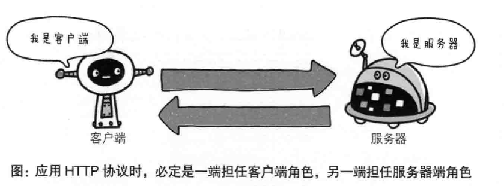
两台计算机之间通信，也必须有一端扮演服务器，一端扮演客户端，时候可以进行角色互换，但是在一条通信线路来说，服务器客户端的角色是确定的，用HTTP协议能够明确区分哪端是服务器端
## 通过请求和响应的交换达成通信
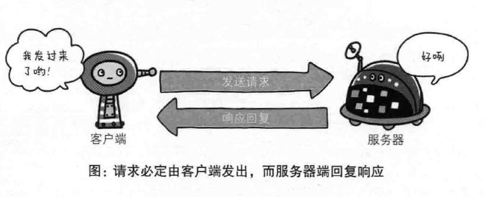
HTTP协议规定，请求从客户端发出，服务器相应该请求并返回，所以，如果客户端不发送请求，服务器端是没有响应的，如果服务器乱响应说明bug了，那么可以得出一个结论，通信肯定是从客户端开始建立的。
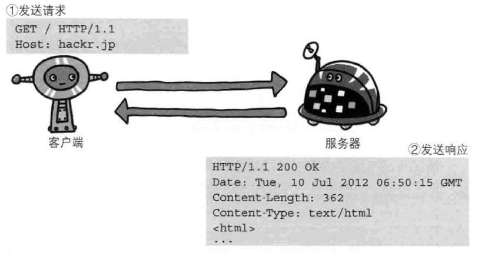
客户端发送给某个HTTP服务器端的请求报文中的内容

解释下上面的请求报文：
- GET表示请求访问服务器的类型，称为方法（Method）
- 字符串/index.html指明请求访问的资源对象，也叫做请求URI（request-URI）
- HTTP/1.1 HTTP的版本号，用来提示客户端使用的HTTP协议功能

合起来就是，请求某台HTTP服务器上的/index.html页面资源
报文组成：
- 请求方法
- 请求URI
- 协议版本
- 可选的请求首部字段
- 内容实体构成的

像这样：
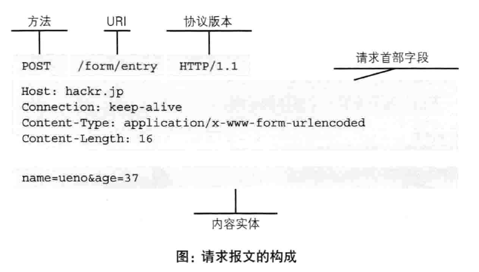

详细研究下请求首部字段，接收到客户端请求的服务器，会用下面的处理结果以响应的形式返回

解释下服务器返回的结果：
- HTTP/1.1 表示HTTP的版本
- 200OK表示请求的处理结果的状态码status code和原因短语reason-phrase
- 接着是创建响应的日期时间，是首部字段header field内的一个属性
- 空行，后面的内容是资源实体entity body

响应报文基本上由上述四个模块组成
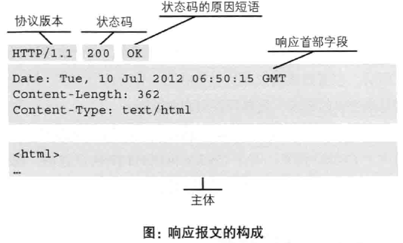

## HTTP是不保存状态的协议
HTTP的另一个性质是不保存状态stateless协议，HTTP协议自身不对请求和响应之间的通信状态进行保存，也就是HTTP这个级别的协议对于发送过请求和相应都没有持久化处理（可以理解为：处理完就忘了）
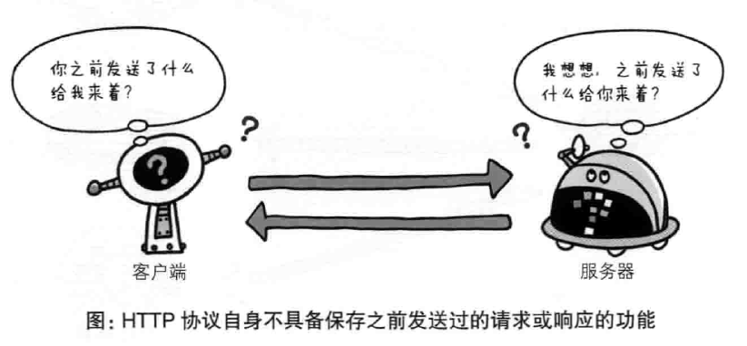
不记忆之前处理的内容的一个好处就是处理大量的事物的时候会变得非常快，设计的这么简单的原因就是为了确保协议的可伸缩性。
但是现在我们可以发现当我们登录某个网站以后怎么跳转都不需要重新登录（按照上面我们说的HTTP协议无记忆功能，这个变得不可行），我们实现这个功能的方法是Cookie，有关Cookie的介绍在后面。
## 请求uri定位资源
uri相当于一种地址格式，互联网上的所有可访问的资源都有一个这种地址，并且这种地址是唯一的：
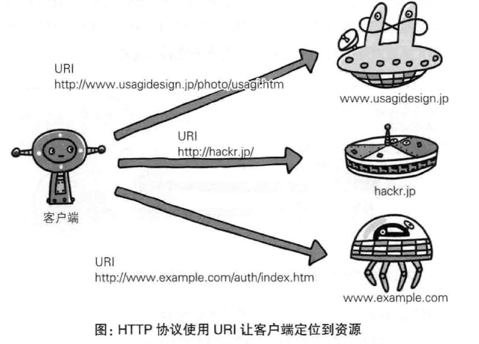
使用uri的方法有两种，一种是直接写完整的uri：
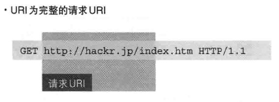
另一种是写成Host加相对地址的方式，host可以使域名或者ip地址
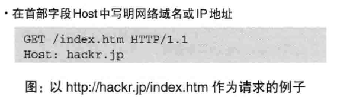
如果并不是访问某个文件而是访问服务器，直接用*代替请求URI：
```http
OPTIONS * HTTP/1.1
```

## 告知服务器意图的HTTP方法
下面简单介绍HTTP/1.1中使用的方法（请求方法）
1. GET 请求访问uri对应的资源，可以返回uri对应的文件，也可以是uri对应程序的结果
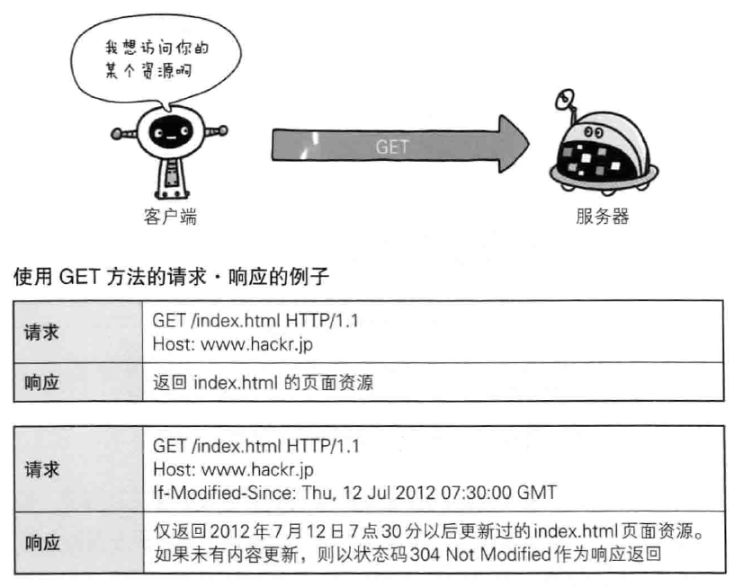
2. POST 传输实体的主体，虽然get也能传输实体的主体，但是一般不用get，post的功能与get很相似，但是post的主要目的并不是获取响应的主体内容
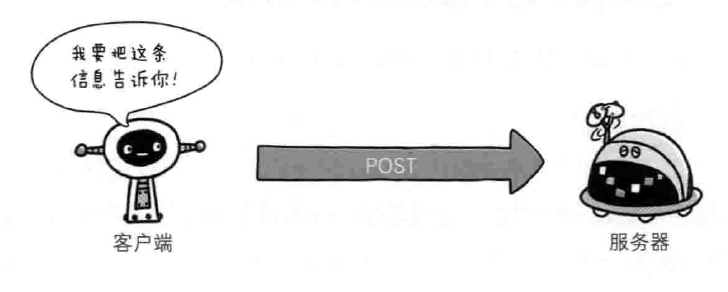
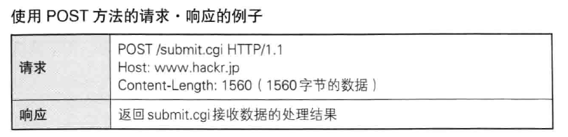
3. PUT 传输文件，与FTP传输文件一样，要求在请求报文的主题中包含文件内容，然后保存到请求uri指定的位置，但是由于HTTP/1.1中对PUT方法本身不带验证机制，，任何人都可以上传文件，存在安全性问题，因此一般的web网站不适用该方法
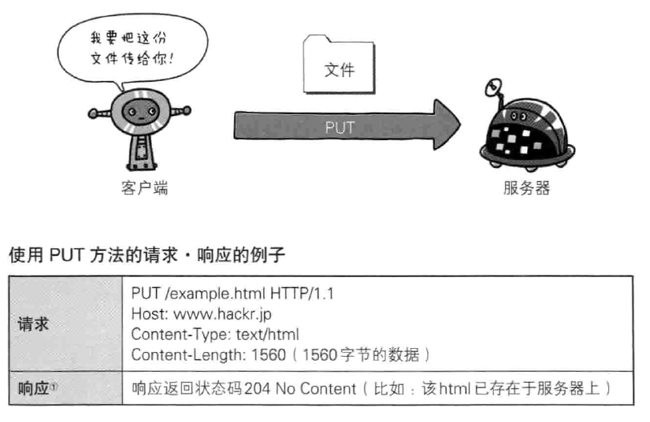
4. HEAD 获得报文首部，与GET方法一样，只是不返回报文主体部分，用于确认URI的有效性及资源更新的日期时间等
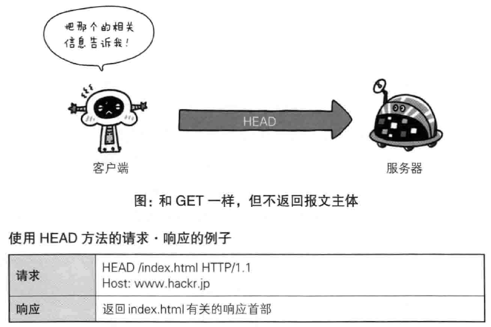
5. DELETE 删除文件，与put相反，DELETE方法删除uri对应的资源，与put一样不安全，一般web站点也不实用DELETE
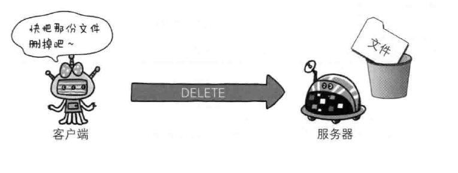
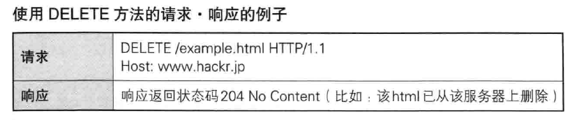
6. OPTIONS 询问支持的方法，查询针对请求URI指定资源的方法
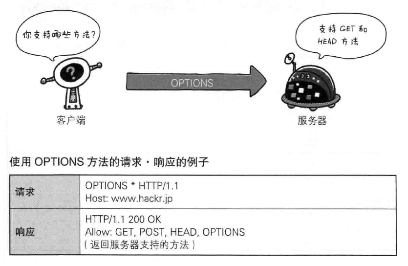
7. TRACE 追踪路径，让web服务器将之前的请求通信环回给客户端的方法，客户端通过trace方法可以查询发送出去的请求是怎么样被加工修改（篡改的），这是因为请求想要连接到源目标服务器可能会通过代理中转，TRACE方法就是用来确认连接过程中发生的一些列操作，但是TRACE不常用，而且其容易引发XST（Cross-Site Tracin个，跨站追踪）攻击，通常就更不会用到了。
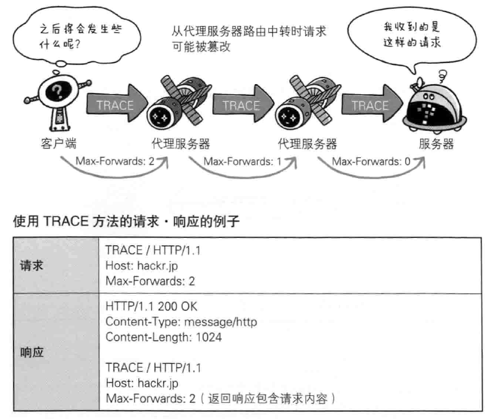
8. CONNECT 用隧道协议连接代理，实现用隧道协议进行TCP，主要使用SSL合同TLS协议吧通信内容加密后经网络隧道传输

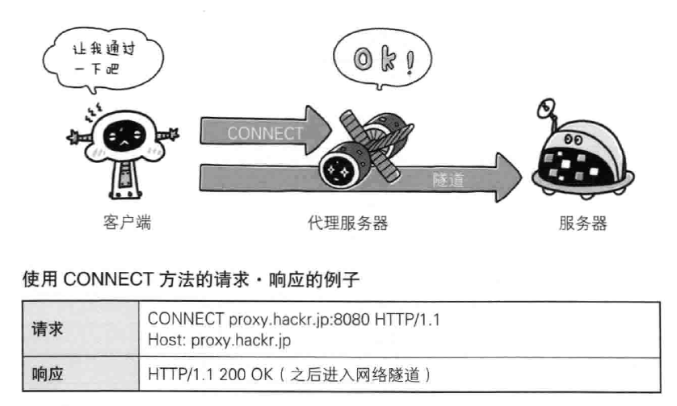


## 使用方法下达命令
方法是一种命令，给uri对应的资源的，在报文中传送这条命令，方法可以指定请求的资源按期望产生某种行为，方法中有GET、POST和HEAD等
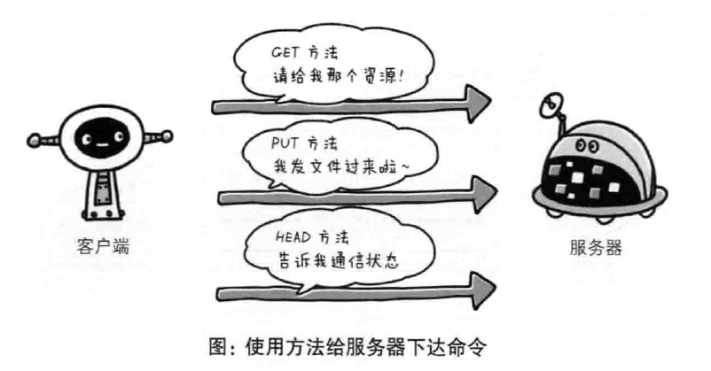

下面我们列举一些方法，注意区分大小写：
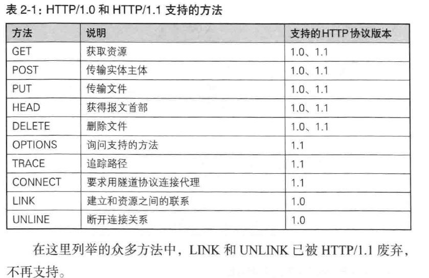
## 使用cookie的状态管理
我们说过HTTP是无状态协议，他不会记住任何之前已经完成的请求和响应状态，如果一个网站不记录你的登录状态，你每次跳转都要重新登录，这是不现实的，假设要求登录认证的web本身无法进行状态管理，那么如果每次跳转不重新登录，就要每次请求报文中附加参数来管理登录状态。
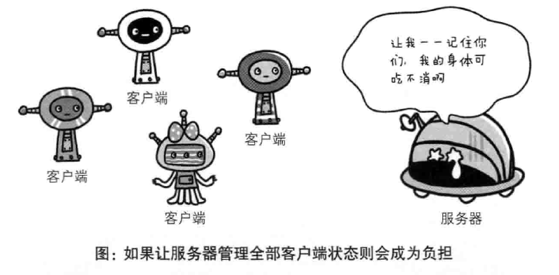
又要保留不需要记忆的这个特性，同时又要不每次跳转都重新登录，于是引入Cookie技术，当服务器响应报文中有set-Cookie 的首部字段信息，客户端就会保存Cookie，下次客户端再往该服务器发送请求时，就会自动在报文中加入Cookie，服务器会在收到Cookie后对比记录，得到之前的状态信息。

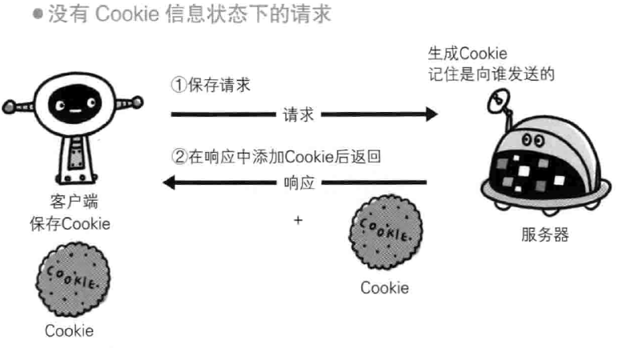

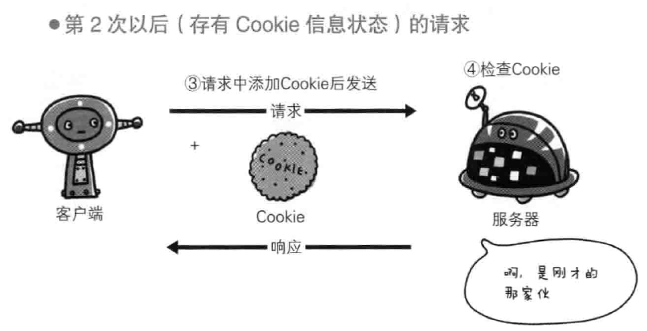
没有Cookie的报文

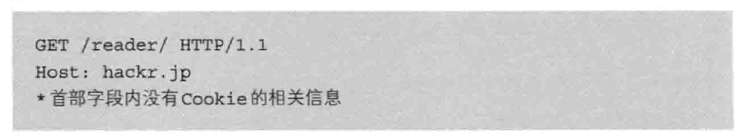

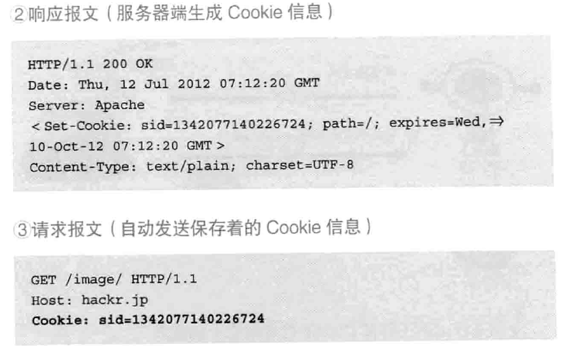
有关响应报文内Cookie对应的首部字段，参考其他资料
这里我就不再介绍了

## 总结
请求报文和响应报文在网络上传来传去，这些报文中的信息就是我们发送的和接受的，我们学习爬虫需要的也就是这部分内容，而具体的算法，实现，硬件部署，这些是网络工程师关心的问题，术业有专攻，我们就不深入的研究别人家的技术了，明天继续爬虫相关知识，待续。。
哈尔滨晚安


