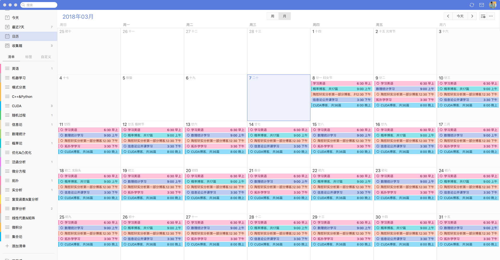
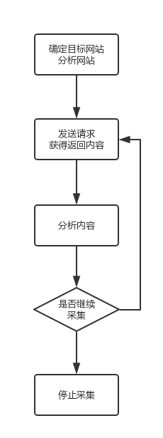
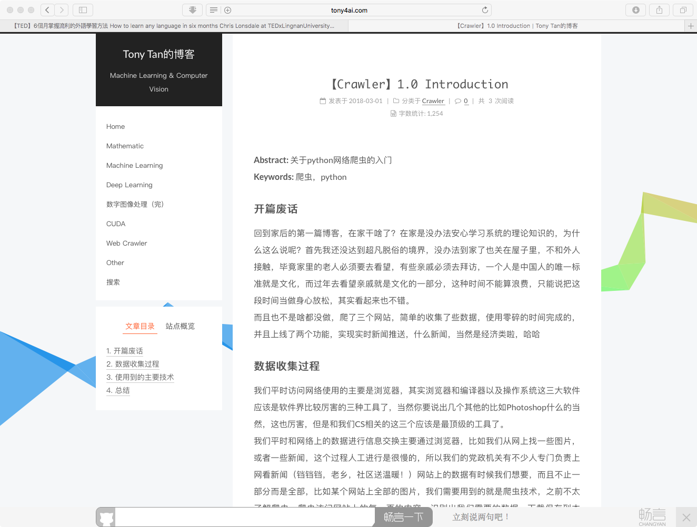

**Abstract:** 介绍三种网页抓取的方法
**Keywords:** 正则表达式,Beautiful Soup,Lxml

<!--more-->

# 数据抓取
本文创建于哈尔滨，完成于深圳，也算是边走边工作了，刚做了下新年计划，这个软件还不错，需要付费，但是能实时提醒下自己，安排下计划也不错


今年还是要忍住外界各种压力，把该打好的基础做好，然后恢复下身体，争取多走出人生的几步，去年前年都走了不少步，有对有错，希望今年也走几步（没病走两步~~）
还是原来那句：**我不是爬虫专家或者前端后台专家，我的努力方向也不是这个方向，我只是想要运用这套技术，但是我又希望对整个过程有一个比较详细的了解，所以我在本系列只是简单介绍，有些东西可能含糊不清，需要详细学习的同学可以去查询相关资料**

## 分析网页
前面讲的[三只虫](http://face2ai.com/Crawler-3-0-第一个爬虫/)已经讲解了如何把静态的网页下载回本地，前两篇HTTP讲了下背后的理论基础，就是向服务器发送请求，得到相应的过程，按照[Introduction](http://face2ai.com/Crawler-1-0-Introduction/)中介绍的处理过程



我们在得到内容后就要进行分析内容了，也就是抓取感兴趣的信息，可以是数据，比如文章，图片，也可以是链接，那么就是下一步要访问的页面了。
分析网页的方法是使用浏览器自带的工具，比如Safari和Chrome的右键都能显示源代码（检查元素）之类的功能

这个源代码（html）就是我们上面用虫子下载到的，而接下来，就是要提取里面的信息了，想要啥，就拿啥。
## 抓取方法
### 正则表达式
正则表达式，是比较好使用，但是通用性不强的一种方法，其实也不是很好用，因为你要首先掌握正则表达式的语法，而掌握了正则表达式的语法以后，你会发现，处理字符串类的文件会变得极其简单，高效，但是正则表达式本身就是个难点，会正则表达式的人也不是那么特别的多，比如我们看下面这个例子，还是上文我们讲的最后一只虫子：
```python
## -*- coding:utf-8 -*-
import urllib2
import re
import urlparse
import datetime
import time
class Throttle:
    """
    限速
    """
    def __init__(self,delay):
        self.delay=delay
        self.domains={}

    def wait(self,url):
        domain=urlparse.urlparse(url).netloc
        last_accessed=self.domains.get(domain)

        if self.delay>0 and last_accessed is not None:
            sleep_secs=self.delay-(datetime.datetime.now()-
                                   last_accessed).seconds
            if sleep_secs>0:
                time.sleep(sleep_secs)
                print 'sleep %d sec'%sleep_secs
        self.domains[domain]=datetime.datetime.now()


def get_links(html):
    print html
    webpage_regex =re.compile('<a[^>]+href=["\'](.*?)["\']',re.IGNORECASE)
    return webpage_regex.findall(html)

def link_crawler(seed_url,link_regex,delay=1):
    throttle=Throttle(delay)
    crawl_queue=[seed_url]
    seen=set(crawl_queue)
    while crawl_queue:
        url=crawl_queue.pop()
        throttle.wait(url)
        html=download(url)
        for link in get_links(html):
            if re.search(link_regex,link):
                link=urlparse.urljoin(seed_url,link)
                if link not in seen:
                    seen.add(link)
                    crawl_queue.append(link)

def download(url,user_agent='tony',proxy=None,num_retries=2):
    print 'Downloading:', url
    headers = {'User-agent': user_agent}
    request=urllib2.Request(url,headers=headers)

    opener=urllib2.build_opener()
    if proxy:
        proxy_params={urlparse.urlparse(url).scheme:proxy}
        opener.add_handler(urllib2.ProxyHandler(proxy_params))
    try:
        response = opener.open(request).read()
    except  urllib2.URLError as e:
        print 'download error:', e.reason

        response = None
        if num_retries > 0:
            if hasattr(e, 'code') and 500 <= e.code < 600:
                print 'download retry'
                return download(url, num_retries - 1)
    return response

if __name__=='__main__':
    url='http://example.webscraping.com'
    link_crawler(url,'/(index|view)')
```

在函数get_link里面
```python
def get_links(html):
    print html
    webpage_regex =re.compile('<a[^>]+href=["\'](.*?)["\']',re.IGNORECASE)
    return webpage_regex.findall(html)
```
html是服务器返回的响应，这里的类型就是字符串：
```html
<!--[if HTML5]><![endif]-->
<!DOCTYPE html>
<!-- paulirish.com/2008/conditional-stylesheets-vs-css-hacks-answer-neither/ -->
<!--[if lt IE 7]><html class="ie ie6 ie-lte9 ie-lte8 ie-lte7 no-js" lang="en-us"> <![endif]-->
<!--[if IE 7]><html class="ie ie7 ie-lte9 ie-lte8 ie-lte7 no-js" lang="en-us"> <![endif]-->
<!--[if IE 8]><html class="ie ie8 ie-lte9 ie-lte8 no-js" lang="en-us"> <![endif]-->
<!--[if IE 9]><html class="ie9 ie-lte9 no-js" lang="en-us"> <![endif]-->
<!--[if (gt IE 9)|!(IE)]><!--> <html class="no-js" lang="en-us"> <!--<![endif]-->
<head>
<title>Example web scraping website</title>
  <!--[if !HTML5]>
      <meta http-equiv="X-UA-Compatible" content="IE=edge,chrome=1">
  <![endif]-->
  <!-- www.phpied.com/conditional-comments-block-downloads/ -->
  <!-- Always force latest IE rendering engine
       (even in intranet) & Chrome Frame
       Remove this if you use the .htaccess -->

  <meta charset="utf-8" />

  <!-- http://dev.w3.org/html5/markup/meta.name.html -->
  <meta name="application-name" content="places" />

  <!--  Mobile Viewport Fix
        j.mp/mobileviewport & davidbcalhoun.com/2010/viewport-metatag
        device-width: Occupy full width of the screen in its current orientation
        initial-scale = 1.0 retains dimensions instead of zooming out if page height > device height
        user-scalable = yes allows the user to zoom in -->
  <meta name="viewport" content="width=device-width, initial-scale=1.0" />

  <link rel="shortcut icon" href="/places/static/images/favicon.ico" type="image/x-icon">
  <link rel="apple-touch-icon" href="/places/static/images/favicon.png">

  <!-- All JavaScript at the bottom, except for Modernizr which enables
       HTML5 elements & feature detects -->
  <script src="/places/static/js/modernizr.custom.js"></script>

  <!-- include stylesheets -->


  <script type="text/javascript"><!--
    // These variables are used by the web2py_ajax_init function in web2py_ajax.js (which is loaded below).
    var w2p_ajax_confirm_message = "Are you sure you want to delete this object?";
    var w2p_ajax_disable_with_message = "Working...";
    var w2p_ajax_date_format = "%Y-%m-%d";
    var w2p_ajax_datetime_format = "%Y-%m-%d %H:%M:%S";
    var ajax_error_500 = 'An error occured, please <a href="/places/default/index">reload</a> the page'
    //--></script>

<meta name="tags" content="web2py, python, web scraping" />
<meta name="generator" content="Web2py Web Framework" />
<meta name="author" content="Richard Penman" />
<script src="/places/static/js/jquery.js" type="text/javascript"></script><link href="/places/static/css/calendar.css" rel="stylesheet" type="text/css" /><script src="/places/static/js/calendar.js" type="text/javascript"></script><script src="/places/static/js/web2py.js" type="text/javascript"></script><link href="/places/static/css/web2py.css" rel="stylesheet" type="text/css" /><link href="/places/static/css/bootstrap.min.css" rel="stylesheet" type="text/css" /><link href="/places/static/css/bootstrap-responsive.min.css" rel="stylesheet" type="text/css" /><link href="/places/static/css/style.css" rel="stylesheet" type="text/css" /><link href="/places/static/css/web2py_bootstrap.css" rel="stylesheet" type="text/css" />


  <!-- uncomment here to load jquery-ui
       <link rel="stylesheet" href="http://ajax.googleapis.com/ajax/libs/jqueryui/1.10.3/themes/ui-lightness/jquery-ui.css" type="text/css" media="all" />
       <script src="http://ajax.googleapis.com/ajax/libs/jqueryui/1.10.3/jquery-ui.min.js" type="text/javascript"></script>
       uncomment to load jquery-ui //-->
  <noscript><link href="/places/static/css/web2py_bootstrap_nojs.css" rel="stylesheet" type="text/css" /></noscript>

</head>

<body>
  <!-- Navbar ================================================== -->
  <div class="navbar navbar-inverse">
    <div class="flash"></div>
    <div class="navbar-inner">
      <div class="container">

        <!-- the next tag is necessary for bootstrap menus, do not remove -->
        <button type="button" class="btn btn-navbar" data-toggle="collapse" data-target=".nav-collapse" style="display:none;">
          <span class="icon-bar"></span>
          <span class="icon-bar"></span>
          <span class="icon-bar"></span>
        </button>

        <ul id="navbar" class="nav pull-right"><li class="dropdown"><a class="dropdown-toggle" data-toggle="dropdown" href="#" rel="nofollow">Log In</a><ul class="dropdown-menu"><li><a href="/places/default/user/register?_next=/places/default/index" rel="nofollow"><i class="icon icon-user glyphicon glyphicon-user"></i> Sign Up</a></li><li class="divider"></li><li><a href="/places/default/user/login?_next=/places/default/index" rel="nofollow"><i class="icon icon-off glyphicon glyphicon-off"></i> Log In</a></li></ul></li></ul>
        <div class="nav">

          <ul class="nav"><li class="web2py-menu-first"><a href="/places/default/index">Home</a></li><li class="web2py-menu-last"><a href="/places/default/search">Search</a></li></ul>

        </div><!--/.nav-collapse -->
      </div>
    </div>
  </div><!--/top navbar -->

  <div class="container">
    <!-- Masthead ================================================== -->

    <header class="mastheader row" id="header">
        <div class="span12">
            <div class="page-header">
                <h1>
                    Example web scraping website
                    <small></small>
                </h1>
            </div>
        </div>
    </header>


    <section id="main" class="main row">


        <div class="span12">


<div id="results">
<table><tr><td><div><a href="/places/default/view/Afghanistan-1"> Afghanistan</a></div></td><td><div><a href="/places/default/view/Aland-Islands-2"> Aland Islands</a></div></td></tr><tr><td><div><a href="/places/default/view/Albania-3"> Albania</a></div></td><td><div><a href="/places/default/view/Algeria-4"> Algeria</a></div></td></tr><tr><td><div><a href="/places/default/view/American-Samoa-5"> American Samoa</a></div></td><td><div><a href="/places/default/view/Andorra-6"> Andorra</a></div></td></tr><tr><td><div><a href="/places/default/view/Angola-7"> Angola</a></div></td><td><div><a href="/places/default/view/Anguilla-8"> Anguilla</a></div></td></tr><tr><td><div><a href="/places/default/view/Antarctica-9"> Antarctica</a></div></td><td><div><a href="/places/default/view/Antigua-and-Barbuda-10"> Antigua and Barbuda</a></div></td></tr></table>
</div>

<div id="pagination">

    &lt; Previous

|

    <a href="/places/default/index/1">Next &gt;</a>

</div>


        </div>


    </section><!--/main-->

    <!-- Footer ================================================== -->
    <div class="row">
        <footer class="footer span12" id="footer">
        </footer>
    </div>

  </div> <!-- /container -->

  <!-- The javascript =============================================
       (Placed at the end of the document so the pages load faster) -->
  <script src="/places/static/js/bootstrap.min.js"></script>
  <script src="/places/static/js/web2py_bootstrap.js"></script>
  <!--[if lt IE 7 ]>
      <script src="/places/static/js/dd_belatedpng.js"></script>
      <script> DD_belatedPNG.fix('img, .png_bg'); //fix any  or .png_bg background-images </script>
      <![endif]-->
</body>
</html>
```
然后我们在这个字符串里找出所有满足
```
'<a[^>]+href=["\'](.*?)["\']'
```
的模式，于是我们就得到了
```
[
'/places/default/index',
'#',
'/places/default/user/register?_next=/places/default/index',
'/places/default/user/login?_next=/places/default/index',
'/places/default/index',
'/places/default/search',
'/places/default/view/Afghanistan-1',
'/places/default/view/Aland-Islands-2',
'/places/default/view/Albania-3',
'/places/default/view/Algeria-4',
'/places/default/view/American-Samoa-5',
'/places/default/view/Andorra-6',
'/places/default/view/Angola-7',
'/places/default/view/Anguilla-8',
'/places/default/view/Antarctica-9',
'/places/default/view/Antigua-and-Barbuda-10',
'/places/default/index/1'
]
```
对比原始HTML确实提取到了所有的url但是并不是很干净所以代码中进一步筛选根据的特性就是网站的所有连接里都有'view' 这个关键字
```python
def link_crawler(seed_url,link_regex,delay=1):
    throttle=Throttle(delay)
    crawl_queue=[seed_url]
    seen=set(crawl_queue)
    while crawl_queue:
        url=crawl_queue.pop()
        throttle.wait(url)
        html=download(url)
        for link in get_links(html):
            if re.search(link_regex,link):
                link=urlparse.urljoin(seed_url,link)
                if link not in seen:
                    seen.add(link)
                    crawl_queue.append(link)
```
上面使用的是[三只虫](http://face2ai.com/Crawler-3-0-第一个爬虫/)里面的代码，其中这两部用到了正则表达式，一个用于提取，一个用于确定，可以看出，正则表达式其实不是很通用，每个网站甚至每个网页都要对应自己的表达式，所以这个基本算是半自动模式，过段时间如果网页代码发生改变，那么正则表达式可能会失效。
### Beautiful Soup
上面的正则表达式是半自动武器，那么Beautiful Soup就是AK47，自动化，强壮，而且好用不贵。
安装方法就是
```bash
pip install Beautifulsoup4
```
与正则表达式不同的是，Beautifulsoup并不是把响应当成字符串处理，而是将html字符串解析成soup文档，相当于构建成了自己的数据结构，然后在使用自己的方法解析，查找，完成一些任务。
但是html有些常见的问题，比如有些语法的缺失：
```html
<ul class = country>
<li>Area
<li>Population
</ul>
```
其中Area和Population都缺失后边的'/li'，那么这种情况可以有两种解释，Population是Area的子元素，另一种他们两个是并列的。Beautifulsoup可以给出以下处理：
```python
from bs4 import BeautifulSoup as bs
bad_html='''<ul class = country>
<li>Area
<li>Population
</ul>'''
soup=bs(bad_html,'lxml')
fixed_html=soup.prettify()
print fixed_html
```
得到的输出是：
```
<html>
 <body>
  <ul class="country">
   <li>
    Area
   </li>
   <li>
    Population
   </li>
  </ul>
 </body>
</html>
```
明显已经被修复了，层次已经明确了，就是并列关系。
bs中find命令和find_all能够找出第一个或者所有的你关心的标签
```python
from bs4 import BeautifulSoup as bs
bad_html='''<ul class = country>
<li>Area
<li>Population
</ul>'''
soup=bs(bad_html,'lxml')
fixed_html=soup.prettify()
print 'find:'
print soup.find('li')
print 'find_all:'
print soup.find_all('li')
```
而且找到结果还是bs类的，可以继续使用find和find_all在结果中搜索。
代码过程复杂在构建bs数据结构那步，需要显示的初始化，其他部分就相对正则表达式简单多了。
### Lxml
xml解析库的python封装版本，解析速度比Beautiful Soup快很多，但是安装有点复杂。
其用法与BeautifulSoup类似。具体可以参考手册，而且其可以利用CSS选择器完成一些高难度的任务
### 性能
以上三种方法性能是有差距的，很明显lxml使用c语言的封装的，应该跑的最快，而Beautiful Soup应该是最慢的，因为有重建过程。而正则表达式也应该是比较快的（也是C语言封装出来的工具箱）
经过测试，有一下的结论可供参考（来自“用python写网络爬虫”）


|    抓取方法    | 性能 | 使用难度 |       安装难度        |
|:--------------:|:----:|:--------:|:---------------------:|
| 正则表达式 | 快 |困难|简单（内置模块）    |
| Beautiful Soup | 慢 | 简单 | 简单（纯python 模块） |
| Lxml | 快 |简单 |相对困难 |


### 添加抓取回调

之前我们讲到的[三只虫](http://face2ai.com/Crawler-3-0-第一个爬虫/)，只讲到如何访问网站所有的网页，这相当于我们转悠了一圈啥也没干，如果要处理点什么问题，比如下载个图片什么的，就要加入响应的功能，为了写一个通用的遍历网站的爬虫，处理问题部分用一个单独的函数，而这个函数作为参数传给遍历网站的模块，这种方法在C++中叫函数指针，这里我们可以称之为回调函数。
再次说明下，我们有一个框架，这个框架可以访问网站中的所有网页，但是框架为了通用性，没有设置每一页具体完成什么动作，而这个动作留作接口供大家发挥，这个接口就是回调函数（C++叫函数指针）

下面我们改造下[三只虫](http://face2ai.com/Crawler-3-0-第一个爬虫/)中的代码，加入回调函数：
```python
def link_crawler(seed_url,link_regex,delay=1,scrape_callback=None,max_depth=10):
    throttle=Throttle(delay)
    crawl_queue=[seed_url]
    seen=set(crawl_queue)
    while crawl_queue:
        url=crawl_queue.pop()
        throttle.wait(url)
        html=download(url)
        links=[]
        if scrape_callback:
            links.extend(scrape_callback(url,html) or [])

        for link in links:
            if re.search(link_regex,link):
                link=urlparse.urljoin(seed_url,link)
                if link not in seen:
                    seen.add(link)
                    crawl_queue.append(link)
```
与原始函数不同的是，我们在这里没有使用固定的获取url的函数get_url(),而是把其作为参数传递进来，这样函数将会更加通用，提示一下，这里面关于最大深度的设定没有实现，如果想使用这段代码，请大家自己添加。
get_url也可以实现任何我们想要的功能，这里就不再赘述了，比如将数据写入文件什么的。
## 总结
本文我们介绍了三种抓取数据的方法，当然是我们关心的数据，同时也通过回调函数的实现，使得框架更为通用。我们下一篇该讲如何高速下载了。
待续。。


